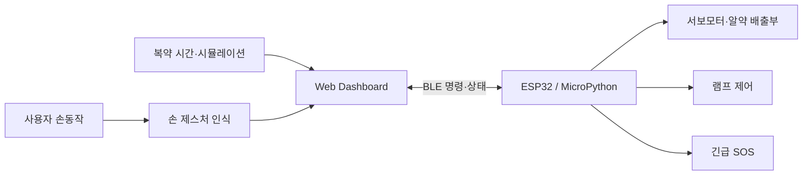

# 💊 Pillume — AIoT 스마트 복약 램프

<div align="center">


**복약 시간 알림·약 배출·조명·긴급 SOS를 하나의 실물 장치로 연결한 고령자 복약 관리 프로토타입**

[프로젝트 개요](#-프로젝트-개요) • [핵심 기능](#-핵심-기능) • [문제 해결](#-핵심-문제-해결) • [시스템 구성](#-시스템-구성) • [검증 범위](#-구현-결과와-검증-범위)

</div>


---

## 📌 프로젝트 개요

**Pillume**은 지정된 복약 시간에 사용자가 손을 가까이 대면 정해진 약을 배출하고, 손 제스처로 램프를 켜고 끄거나 긴급 SOS를 전달할 수 있도록 제작한 AIoT 스마트 복약 램프입니다.

ESP32, MicroPython, Web, BLE, 손 제스처 인식, 서보모터와 3D 프린팅 기구물을 하나의 흐름으로 연동했습니다. 단순 화면 시연이 아니라 알약통과 배출구를 직접 제작하고, 실제 장치에서 명령 전달과 상태 확인이 가능한 프로토타입을 구현하는 데 초점을 맞췄습니다.

---

## ✨ 핵심 기능

| 기능 | 동작 |
| --- | --- |
| 복약 안내·배출 | 지정된 복약 시간에 손을 감지하면 해당 약 칸을 배출구에 정렬해 약 배출 |
| 제스처 조명 제어 | 손 제스처를 인식해 램프 ON/OFF 제어 |
| 긴급 SOS | 위험 상황을 알리기 위한 SOS 명령 전달 |
| 양방향 상태 연동 | Web 명령을 장치에 전달하고 ESP32 상태정보를 화면에서 확인 |
| 복약 시뮬레이션 | 실제 아침·점심·저녁 시간을 기다리지 않고 복약·미복약 시나리오 반복 점검 |

---

## 🔧 핵심 문제 해결

### 1. 설계값과 실제 출력물의 배출 위치 편차

- CATIA로 설계한 알약통을 출력해 서보모터와 조립하자 계산한 위치와 실제 배출 위치 사이에 편차가 발생했습니다.
- 계산값만 적용하지 않고 실물 조립 상태에서 서보모터 회전각을 반복 조정했습니다.
- 각 약 칸과 배출구가 실제 장치에서 정렬되도록 보정해 안정적인 약 배출 구조를 구성했습니다.

### 2. 배경에 따라 달라지는 손 제스처 인식

- 같은 손동작도 학습 배경과 실제 사용 배경이 달라지면 인식 결과가 흔들리는 문제를 확인했습니다.
- 학습 환경과 실제 사용 환경의 배경 조건을 통일해 입력 편차를 줄였습니다.
- 장치가 놓이는 환경까지 인식 성능의 일부로 보고 조건을 관리했습니다.

### 3. 긴 복약 주기로 인한 반복 검증 한계

- 실제 복약 시간만 기다려서는 약 배출과 미복약 상황을 빠르게 반복 점검하기 어려웠습니다.
- 시간 조건을 압축해 실행하는 Simulation Mode를 추가했습니다.
- ESP32-Web 간 BLE 양방향 통신으로 명령과 상태정보를 함께 확인할 수 있도록 구성했습니다.

---

## 🏗️ 시스템 구성



---

## 🧰 기술 구성

| 구분 | 사용 기술 |
| --- | --- |
| Embedded | ESP32, MicroPython, Arduino |
| Communication | BLE 양방향 통신 |
| AI | 손 제스처 분류 모델 |
| Mechanical | CATIA, 3D Printing, Servo Motor |
| Web | HTML, CSS, JavaScript, TypeScript |

---

## 📁 저장소 구조

```text
AIoT---SMarT-HoME/
├── SmartDispenser.ino                 # 약 배출 장치 제어
├── index.html / index.css / app.js    # Web Dashboard
├── Pillume-Stitch-48489-Complete/     # UI 프로젝트
├── ESP_SZ-55-110-165-Complete/        # 통합 작업본
├── PRD.md                             # 시스템 요구사항
└── Pillume_Dashboard_PRD_Stitch.md    # Dashboard 설계 문서
```

---

## ✅ 구현 결과와 검증 범위

- 지정 시간 복약 안내, 약 배출, 조명 제어와 SOS 기능을 하나의 프로토타입으로 연동
- 설계값과 3D 출력물의 물리적 편차를 실물 기준 서보모터 각도 보정으로 개선
- 학습·사용 배경 조건을 통일해 손 제스처 인식 흔들림 완화
- Simulation Mode와 BLE 상태 연동으로 복약·미복약 시나리오 반복 점검

> 본 저장소는 교육 프로젝트에서 제작한 프로토타입입니다. 의료기기 또는 상용 복약 관리 시스템을 의미하지 않습니다.
